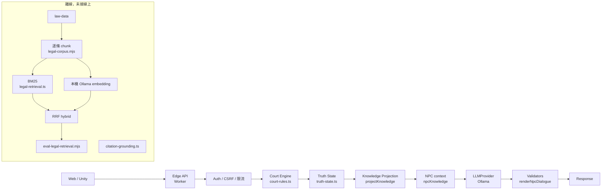

# AI 架構重設計（2026-09-28，分支 `ai/p0-projection-bm25`）

範圍依精簡規格（Claude 負責的 AI／RAG 部分）。前端、Unity、API 基礎設施、migration、CI 框架屬其他開發線，本文件只描述邊界，不改動它們。**本批沒有部署、沒有 migration、沒有改 wrangler binding、沒有新增付費服務。**

## 1. 現況（本批之前）

| 元件 | 實際狀態 |
|---|---|
| 法庭流程 | `src/court-rules.ts` 決定階段、角色、年齡與法律協助限制；伺服器是唯一權威。LLM 不推進階段、不判分。 |
| NPC 對話 | `src/court-npc.ts`：依角色挑一組文字（`npcKnowledge`），模型只能回傳 `factIds` 選擇，`renderNpcDialogue` 驗證。角色範圍是寫在函式裡的條件式，沒有獨立的資訊模型。 |
| 公開投影 | `court-rules.ts` 的欄位白名單（Codex，見 `docs/COURT-PUBLIC-PROJECTION.md`）。這是對 client 的投影，不依角色過濾。 |
| 字典 | `src/dictionary.ts`：教育部辭典**精確詞目查詢**。不是 RAG，沒有向量。 |
| 法規語料 | `law-data/`：法務部全國法規資料庫 Open API 快照（2026-09-01 產生，來源更新 2026/8/21）。已逐條存放，但**沒有任何檢索程式使用它**。 |
| Provider | `src/providers/contracts.ts` 已定義 `LLMProvider`、`EmbeddingProvider`、`RerankProvider` 介面；只有 Ollama 的 LLM 實作。 |
| 研究基礎設施 | `research/`、`contracts/experiment-*.schema.json`（Codex）；登錄表刻意留空。 |

技術債（只列與 AI 相關的）：角色可知範圍散落在條件式裡、無法單獨測試；法規語料未被使用；沒有任何檢索評測；引用驗證只有「不得出現『第N條』」這種黑名單式規則。

## 2. 本批新增

### 2.1 Truth State 與 Knowledge Projection（`src/truth-state.ts`）

- `buildTruthState(state)`：把案件轉成不可變的項目清單。每個項目有 `sourceId`、`kind`、`text`、`holders`（可知角色）。
- 答案、選項、解析放在 `answer-key` 項目，`holders` 為空：**任何角色都拿不到**。
- `projectKnowledge(truth, role, {admittedEvidenceIds?})`：預設拒絕，只回傳該角色是 holder 的項目。玩家問題**不是輸入參數**，所以任何措辭都無法擴大範圍。
- 有給 `admittedEvidenceIds` 時，一般證物只給已調查的；證人自己的證詞不受限制。
- `npcKnowledge()` 改成透過 projection 取資料。`scripts/test-truth-state.mjs` 驗證 6 個範本 × 5 個角色的輸出與舊版逐字相同。模型仍只看到 `k0..kn`，對應的 `sourceIds` 只留在伺服器。

**刻意未改變的行為（需要產品決定）：**
- NPC 目前**沒有**傳 `admittedEvidenceIds`，律師 NPC 仍在任何階段都知道全部證物，與舊版一致。開啟後，律師在「調查證據」前會變得比較沉默，這會影響玩法，所以不在本批直接開。
- `privateGraph` 的證人-事實關係尚未併入 Truth State，因為目前沒有案件真的存有 privateGraph。
- 對話紀錄（transcript）沒有進 projection；NPC 仍用既有的「同角色最近 4 筆」history。

### 2.2 法規檢索（`src/legal-retrieval.ts`、`scripts/legal-corpus.mjs`）

- chunk 單位 = 一條條文，不切段，維持條文邊界。只取「中央法律」、未廢止的法律，共 40,818 條；「中央命令」沒有納入。
- 每個 chunk：`chunkId`（`pcode:條號`）、`documentId`、法規名稱、條號、官方單條網址、`lawModifiedDate`、來源更新日、`checkedDate`（快照時間）、SHA-256。
- 重複 `chunkId` 直接丟錯；同一快照只有一個來源版本，不會混用。注意：`lawModifiedDate` 是法務部的「修正日期」，**不一定是施行日**。
- BM25：字元 bigram，k1=1.2、b=0.75，同分時以 `chunkId` 排序，所以結果可重現。
- RRF（k=60）用來融合 BM25 與 dense。
- **尚未接到任何線上 API。** 線上回答法律問題仍然沒有使用檢索。

### 2.3 Citation Grounding（`src/citation-grounding.ts`）

回應格式：`{answer, citationIds, factIds, uncertainty}`，`fallbackUsed` 由伺服器加上，模型不能自己宣告。伺服器會拒絕以下情況：

- 多出欄位，例如 verdict、stage
- 引用本次檢索結果以外的 `citationId`
- 使用不屬於該角色 projection 的 `factId`
- 標示為非高不確定性，卻沒有任何引用
- 內文提到的條號（含國字與「之一」寫法）不在已引用的條文中
- 內文含有標記或網址

通過驗證只代表**引用的 ID 都有依據**，不代表文字內容正確。

### 2.4 測試（皆進 `scripts/ci-fast.mjs`，自動以 `test-*.mjs` 收錄）

| 檔案 | 內容 |
|---|---|
| `test-truth-state.mjs` | 與舊版等價、answer-key 不外洩、證物調查閘門、不可變 |
| `test-legal-retrieval.mjs` | 斷詞、BM25、RRF、條號解析、citation 驗證 |
| `test-leakage.mjs` | 12 種輸入攻擊 × 5 個角色、11 種輸出攻擊、8 種引用攻擊（含檢索內容中的間接注入） |

洩漏測試用的是測試 provider，**不是 E2E，也不測模型本身會不會拒絕**。它驗證的是：不論玩家問什麼，送進模型的資料都不含該角色不該知道的內容；不論模型回什麼，越權的 ID 都會被擋下。已做過 mutation 檢查：故意讓法官拿到證物後，12 項輸入攻擊測試全部失敗。

## 3. 檢索評測

見 `research/results/legal-retrieval-*.md`。題庫 `benchmark/legal-retrieval-v0.json`：40 題，**由 AI 撰寫、未經專家審查、只有 dev split、沒有 hidden test**。每個正解 `chunkId` 都已確認存在於語料中。所有數字都由 `node scripts/eval-legal-retrieval.mjs` 實際跑出，沒有調整題目去配合結果。

## 4. 與 Codex 的界線

- Claude（本批）：Truth State、Knowledge Projection、檢索、citation 驗證、洩漏測試、評測。
- Codex：API、Court Engine、event log、migration、CI 框架、provider 實作與治理（admission、tracing）。
- 共同：若要把 `EmbeddingProvider` 接上線，需要 Codex 實作 adapter 並納入 admission；向量索引的儲存（Vectorize 或靜態資產）需另行評估費用，因為目前規則禁止付費。

## 5. 風險、相容性、rollback

- 沒有 migration、沒有改儲存格式、沒有新增 API 欄位。`NpcReply` 格式不變。
- `npcKnowledge` 的回傳多了 `sourceIds`，只在伺服器內部使用，不送給 client 或模型。
- Rollback：revert 這個分支的 commit 即可，沒有資料需要轉換。
- `.cache/embeddings/` 已加入 gitignore，向量可以從 law-data 重新產生。

## 6. 成本

本批完全離線。評測只使用本機 Ollama，沒有雲端 API 呼叫。線上成本沒有變化。

## 7. 未做（依精簡規格第 13 節）

reranker、chunking 比較、AI 案件生成、Agent Memory、1000 題以上的 benchmark、ablation、人評、教育研究、壓力測試、dashboard、技術報告。
